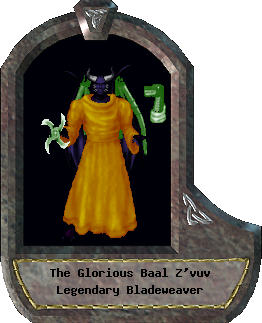

# Ultima Online Paperdoll Drawer

A PHP library to draw Ultima Online characters' paperdoll images.



## Requirements

* PHP >= 7.1
* GD extension
* These Ultima Online client files (you need to provide them from your UO installation):
   * `gumpidx.mul`
   * `gumpart.mul`
   * `tiledata.mul`
   * `hues.mul`

## Installation

Via composer:

```sh
$ composer require ppardalj/ultima-paperdoll-drawer-php
```

## Usage

### Ultima Online client files

You need to provide your Ultima Online client MUL files and place them into the [uofiles](./uofiles/) directory. If you're using a newer Ultima Online installation and your client files are UOP format, you'll need to use a tool (such as LegacyMulConverter) to convert your files to MUL format.

### Code

Once your MUL files are placed, in your PHP script use the class `PaperdollBuilder` to customize the paperdoll of your character. You can use a fluent interface to change the name, title, skin hue, race, gender, and add items.

Finally, get an instance of the `PaperdollDrawer` class configured with your Ultima Online client files, and use it to draw the paperdoll you just built.

You will get an image `resource` which you can use the way you want.

```php
$drawer = PaperdollDrawer::with('/path/to/uofiles');

$paperdoll = PaperdollBuilder::create('Lord Semerkhet')
    ->withTitle('Legendary Developer')
    ->withItem(new Item(9860, 1109, Layer::NECK)) // Hooded shroud of shadows
    ->build();

$paperdollImage = $drawer->drawPaperdoll($paperdoll);
imagepng($paperdollImage, 'mypaperdoll.png'); // save to png file
```

You can find more examples in the [examples](./example/) directory.

## Contributing

Please feel free to report any bug you find, or submit a pull request with new features, bug fixes, etc.

## License

This program is free software: you can redistribute it and/or modify it under the terms of the GNU General Public License as published by the Free Software Foundation, either version 3 of the License, or (at your option) any later version.

This program is distributed in the hope that it will be useful, but WITHOUT ANY WARRANTY; without even the implied warranty of MERCHANTABILITY or FITNESS FOR A PARTICULAR PURPOSE. See the GNU General Public License for more details.

You should have received a copy of the GNU General Public License along with this program. If not, see <http://www.gnu.org/licenses/>.
